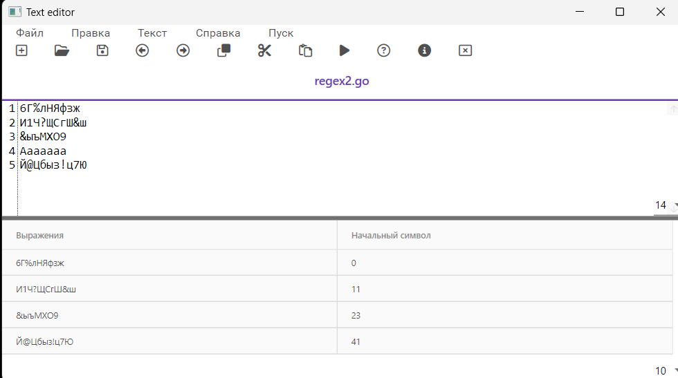
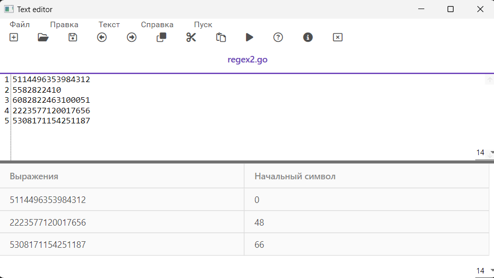
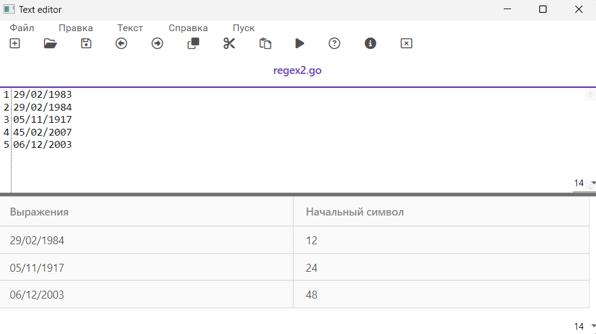

# Реализация алгоритма поиска подстрок с помощью регулярных выражений.

## Цель

Реализовать алгоритм поиска в тексте подстрок, соответствующих заданным регулярным выражениям.

## Варианты задания
**Построить РВ, описывающее пароль (набор строчных и прописных русских букв, цифр и символов).**

РВ: (?=.*[а-яё])(?=.*[А-ЯЁ])(?=.*\d)(?=.*[@$!%*?&])[А-ЯЁа-яё\d@$!%*?&]{1,}

**Тестовые примеры**

**Построить РВ, описывающее номера карт, принадлежащих платежной системе MasterCard.**

РВ: 5[1-5][0-9]{14}|(222[1-9]|22[3-9]\\d|2[3-6]\\d{2}|27[0-1]\\d|2720)[0-9]{12}

**Тестовые примеры**

**Построить РВ для проверки даты, учитывая високосные годы. Формат даты: DD/MM/YYYY.**

РВ: (?:(?:29([-./])02(?:\1)(?:(?:(?:1[6-9]|20)(?:04|08|[2468][048]|[13579][26]))|(?:1600|2[048]00)))|(?:(?:(?:0[1-9]|1\d|2[0-8])([-./])(?:0[1-9]|1[0-2]))|(?:29|30)([-./])(?:0(?:1|[3-9])|(?:1[0-2]))|31([-./])(0[13578]|1[02]))(?:\2|\3|\4)(?:1[6-9]|2\d)\d\d)

**Тестовые примеры**

