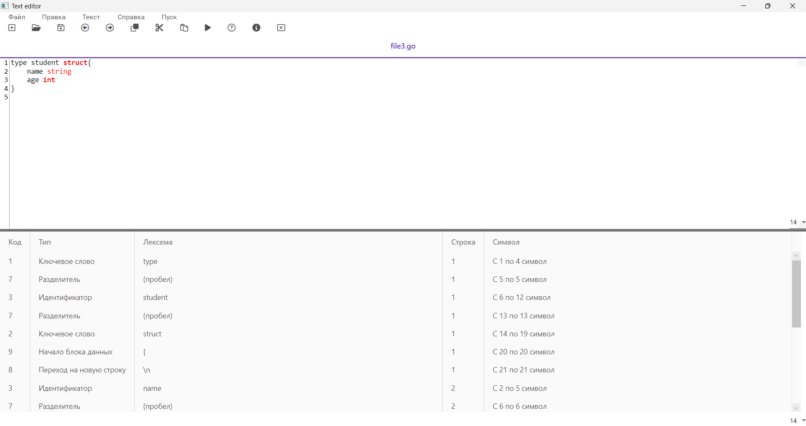
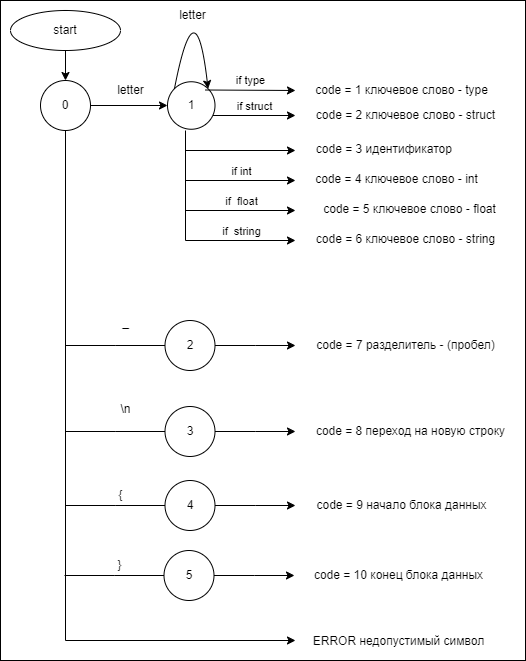
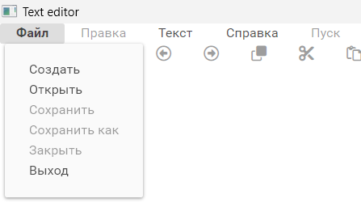
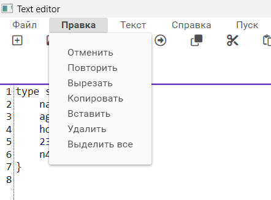
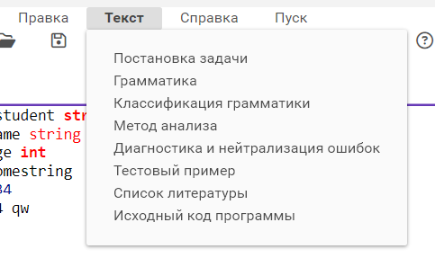
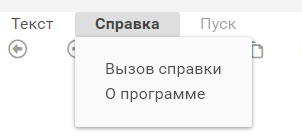
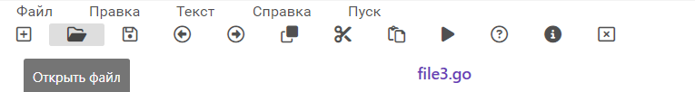
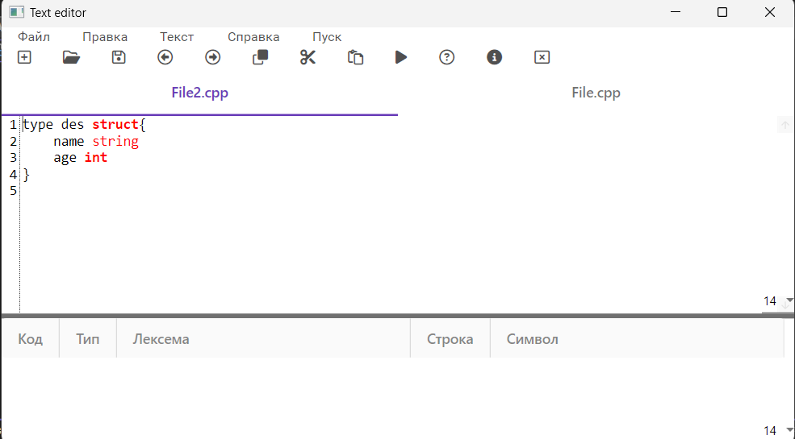
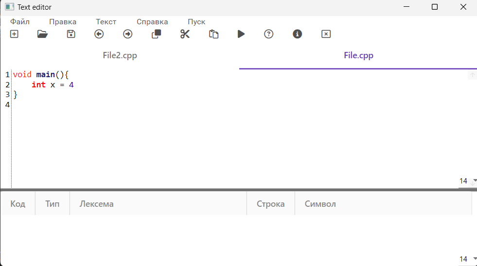
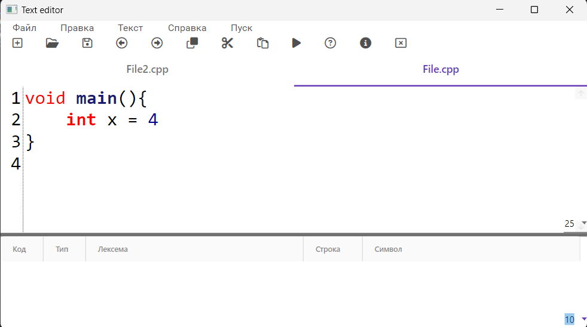

# Лексический анализатор (сканер)

<p align="center"></p>

## Постановка задачи

Изучить назначение лексического анализатора. Спроектировать алгоритм и выполнить программную реализацию сканера.

## Вариант задания
**Объявление структуры на языке Go.**

Пример допустимых строк:
```
type Address struct {
    Name    string
    city    string
    Pincode int
}
```


## Диаграмма состояний сканера

<p align="center"></p>

## Пользовательский интерфейс приложения
### Меню текстового редактора

**Пункт "Файл" меню текстового редактора**

В пункте "Файл" меню текстового редактора реализован следующий
функционал:
- Создание документа
- Открытие документа
- Сохранение текущих изменений в документе
- Сохранение документа в новый файл
- Закрытие текущей вкладки
- Выход из текстового редактора


<p align="center"></p>

**Пункт "Правка" меню текстового редактора**

В пункте "Правка" меню текстового редактора реализован следующий
функционал:
- Отмена изменений
- Повтор последнего изменения
- Вырезать текстовый фрагмент
- Копировать текстовый фрагмент
- Вставить текстовый фрагмент
- Удалить текстовый фрагмент
- Выделить все содержимое документа

<p align="center"></p>

**Пункт "Текст" меню текстового редактора**

Пункт меню "Текст" содержит следующую информацию 
- Постановка задачи
- Грамматика
- Классификация грамматики
- Метод анализа
- Диагностика и нейтрализация ошибок
- Тестовый пример
- Список литературы
- Исходный код программы

<p align="center"></p>

**Пункт "Справка" меню текстового редактора**

Приложение имеет справочную систему, запускаемую командой «Вызов справки».

Справка содержит описание всех реализованных функций меню.

<p align="center"></p>

**Пункт "Пуск" меню текстового редактора**

При нажатии на пункт "Пуск" происходит запуск анализатора текста

### Панель инструментов текстового редактора

Панель инструментов содержит кнопки вызова часто используемых пунктов меню:
- Создание документа
- Открытие документа
- Сохранение текущих изменений в документе
- Отмена изменений
- Повтор последнего изменения
- Копировать текстовый фрагмент
- Вырезать текстовый фрагмент
- Вставить текстовый фрагмент
- Запуск синтаксического анализатора
- Вызов справки - руководства пользователя
- Вызов информации о программе
- Закрытие текущей вкладки

<p align="center"></p>

### Дополнительные возможности текстового редактора

1. Интерфейс позволяет работать с несколькими текстовыми документами одновременно.
<p align="center"></p>
<p align="center"></p>

2. Интерфейс позволяет изменять размер шрифта в окне текстового редактора или окне результатов
<p align="center"></p>

3. Нумерация строк в окне редактирования текста.
4. Интерфейс позволяет открывать файл при перетаскивании его иконки в область редактирования.