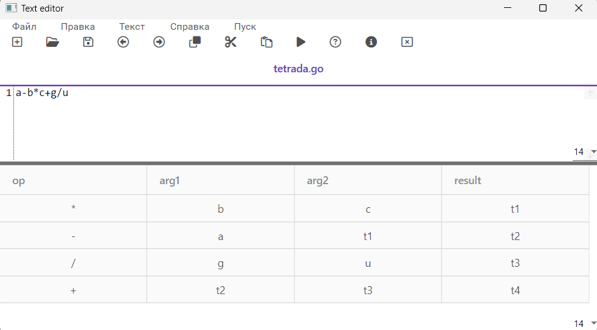
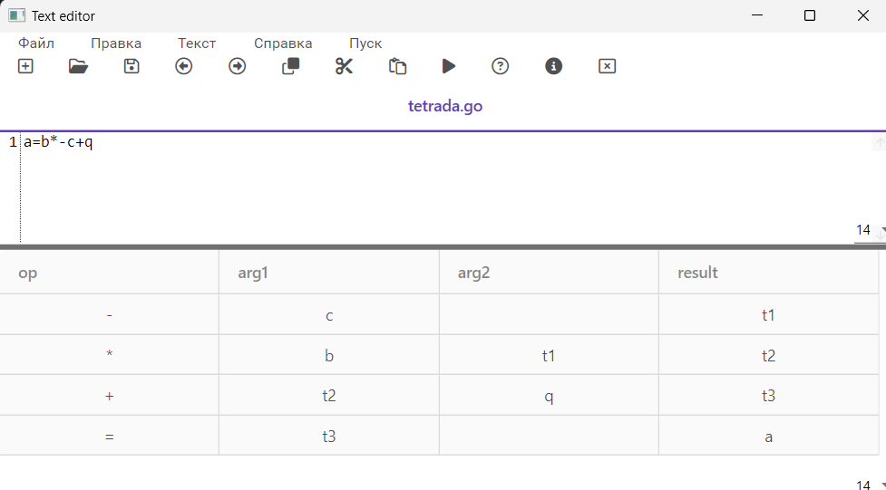
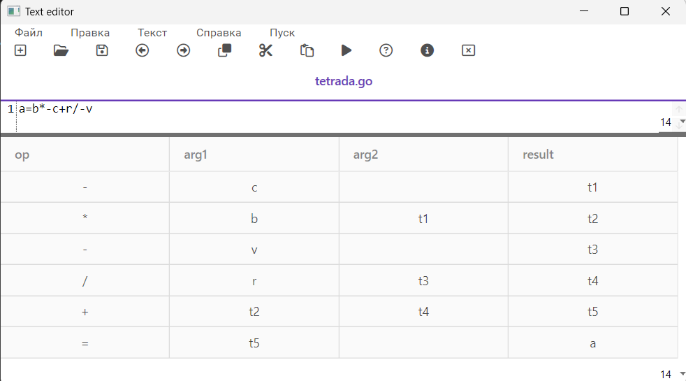
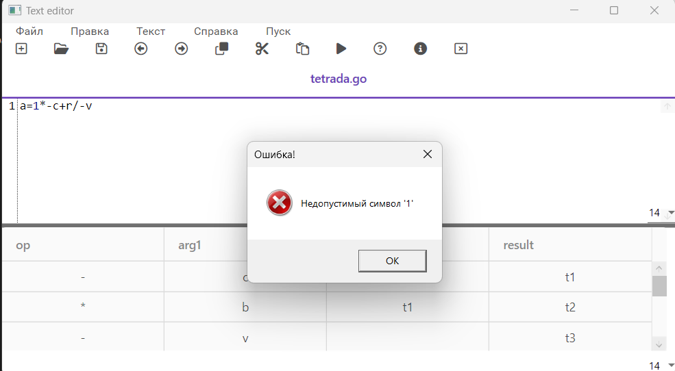
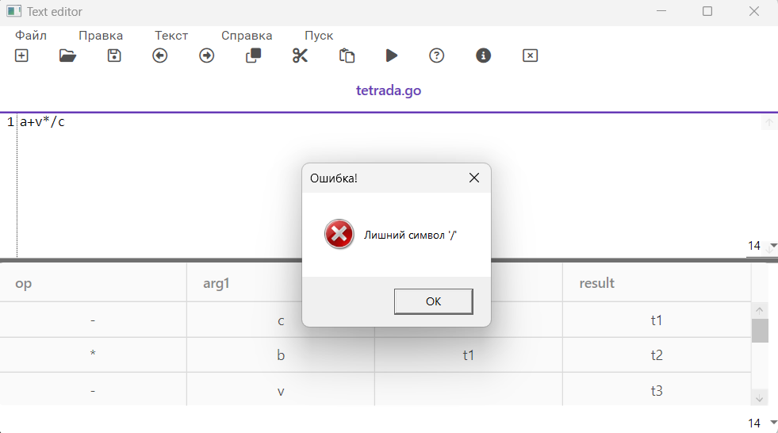

# Включение семантики в анализатор. Создание внутренней формы представления программы.

## Цель

Дополнить анализатор, разработанный в рамках лабораторных работ, этапом формирования внутренней формы представления программы.

## Вариант задания

2 вариант. В качестве внутренней формы представления программы выберем тетрады. Тетрада имеет четыре поля: op, arg1, arg2 и result.

Задание:

1)Дополнить парсер грамматикой G[<АВ>]. Реализовать данную КС-граммматику методом рекурсивного спуска:

1. E → TA 

2. A → ε | + TA | - TA 

3. T → ОВ 

4. В → ε | *ОВ | /ОВ 

5. О → id | (E) 

2)Реализовать алгоритм записи выражений в форме тетрад.

Пример допустимых строк:
```
a+b-c
```

```
a/b*c
```

```
a-b*c+g/u
```

```
a=b*-c+q
```

```
a=b*-c+r/-v
```

## Тестовые примеры

1. <p align="center"></p>
1. <p align="center"></p>
1. <p align="center"></p>
1. <p align="center"></p>
1. <p align="center"></p>