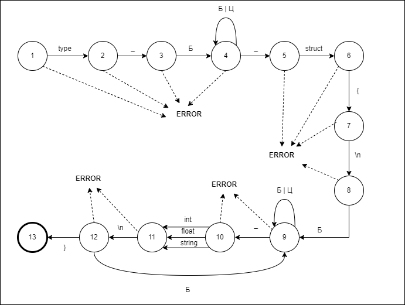
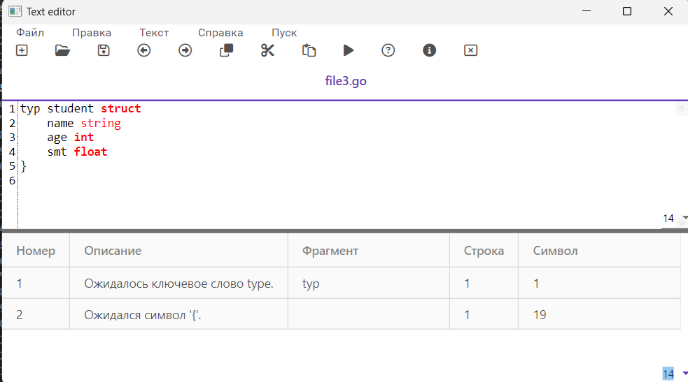
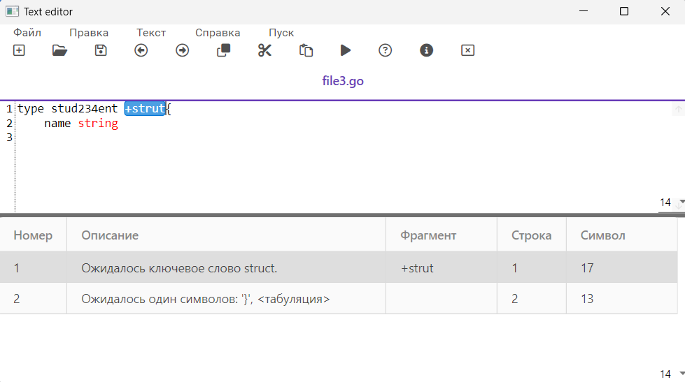

# Синтаксический анализатор для объявления структуры на языке Go.

## Цель

Выполнить программную реализацию алгоритма синтаксического анализа для объявления структуры на языке Go.

## Вариант задания
**Объявление структуры на языке Go.**

Пример допустимых строк:
```
type Address struct {
    Name string
    city string
    Pincode int
}

type student struct {
    Name string
    age int
}
```

## Разработанная грамматика

1. ‹Def› → ‹Letter›‹TypeRem›
1. ‹TypeRem› → ‹Letter›‹TypeRem›
1. ‹TypeRem› → _‹Id›
1. ‹Id› → ‹Letter›‹IdRem›
1. ‹IdRem› → ‹Letter›‹IdRem›
1. ‹IdRem› → _‹Struct›
1. ‹Struct› → ‹Letter›‹StructRem›
1. ‹StructRem› → ‹Letter›‹StructRem›
1. ‹StructRem› → _‹BlockStart›
1. ‹StructRem› → {‹NewLine›
1. ‹BlockStart› → {‹NewLine›
1. ‹NewLine› → \n‹FieldLine›
1. ‹FieldLine› → \t‹FieldId›
1. ‹FieldId› → ‹Letter›‹FieldIdRem›
1. ‹FieldIdRem› → ‹Letter›‹FieldIdRem›
1. ‹FieldIdRem› → _‹FieldType›
1. ‹FieldType› → ‹Letter›‹FieldTypeRem›
1. ‹FieldTypeRem› → ‹Letter›‹FieldTypeRem›
1. ‹FieldTypeRem› →  \n‹EndBlock›
1. ‹EndBlock› → \t‹FieldId›
1. ‹EndBlock› →  }
- ‹Letter› → “a” | “b” | “c” | ... | “z” | “A” | “B” | “C” | ... | “Z”

Следуя введенному формальному определению грамматики, представим G[‹Def›] ее составляющими:
- Z = ‹Def›;
- V<sub>T</sub> = {a, b, c, ..., z, A, B, C, ..., Z, _, {, }, \n, \t};
- V<sub>N</sub> = {‹Def›, ‹TypeRem›, ‹Id›, ‹IdRem›, ‹Struct› , ‹StructRem›, ‹BlockStart› , ‹NewLine› , ‹FieldLine› , ‹FieldId› , ‹FieldIdRem› , ‹FieldType› , ‹FieldTypeRem› , ‹EndBlock›}.


## Классификация грамматики

Согласно классификации Хомского, грамматика G[‹Def›] является автоматной. 
Правила (1)-(21) относятся к классу праворекурсивных продукций (A → aB | a | ε):

1. ‹Def› → ‹Letter›‹TypeRem›
1. ‹TypeRem› → ‹Letter›‹TypeRem›
1. ‹TypeRem› → _‹Id›
1. ‹Id› → ‹Letter›‹IdRem›
1. ‹IdRem› → ‹Letter›‹IdRem›
1. ‹IdRem› → _‹Struct›
1. ‹Struct› → ‹Letter›‹StructRem›
1. ‹StructRem› → ‹Letter›‹StructRem›
1. ‹StructRem› → _‹BlockStart›
1. ‹StructRem› → {‹NewLine›
1. ‹BlockStart› → {‹NewLine›
1. ‹NewLine› → \n‹FieldLine›
1. ‹FieldLine› → \t‹FieldId›
1. ‹FieldId› → ‹Letter›‹FieldIdRem›
1. ‹FieldIdRem› → ‹Letter›‹FieldIdRem›
1. ‹FieldIdRem› → _‹FieldType›
1. ‹FieldType› → ‹Letter›‹FieldTypeRem›
1. ‹FieldTypeRem› → ‹Letter›‹FieldTypeRem›
1. ‹FieldTypeRem› →  \n‹EndBlock›
1. ‹EndBlock› → \t‹FieldId›
1. ‹EndBlock› →  }

## Граф конечного автомата

Грамматика G[‹Def›] является автоматной.
Правила (1) – (21) для G[‹Def›] реализованы на графе.
Сплошные стрелки на графе характеризуют синтаксически верный разбор; пунктирные символизируют состояние ошибки (ERROR); и непомеченные дуги предполагают любой терминальный символ, отличный от указанного из соответствующего узла.
Состояние 15 символизирует успешное завершение разбора.

<p align="center"></p>

## Тестовые примеры

1. <p align="center"></p>
1. <p align="center"></p>
1. <p align="center"></p>
1. <p align="center"></p>
1. <p align="center"></p>

## Диаграмма состояний сканера

<p align="center"></p>

## Тестовые примеры

1. <p align="center"></p>
2. <p align="center"></p>
3. <p align="center"></p>

## Пользовательский интерфейс приложения
### Меню текстового редактора

**Пункт "Файл" меню текстового редактора**

В пункте "Файл" меню текстового редактора реализован следующий
функционал:
- Создание документа
- Открытие документа
- Сохранение текущих изменений в документе
- Сохранение документа в новый файл
- Закрытие текущей вкладки
- Выход из текстового редактора


<p align="center"></p>

**Пункт "Правка" меню текстового редактора**

В пункте "Правка" меню текстового редактора реализован следующий
функционал:
- Отмена изменений
- Повтор последнего изменения
- Вырезать текстовый фрагмент
- Копировать текстовый фрагмент
- Вставить текстовый фрагмент
- Удалить текстовый фрагмент
- Выделить все содержимое документа

<p align="center"></p>

**Пункт "Текст" меню текстового редактора**

Пункт меню "Текст" содержит следующую информацию 
- Постановка задачи
- Грамматика
- Классификация грамматики
- Метод анализа
- Диагностика и нейтрализация ошибок
- Тестовый пример
- Список литературы
- Исходный код программы

<p align="center"></p>

**Пункт "Справка" меню текстового редактора**

Приложение имеет справочную систему, запускаемую командой «Вызов справки».

Справка содержит описание всех реализованных функций меню.

<p align="center"></p>

**Пункт "Пуск" меню текстового редактора**

При нажатии на пункт "Пуск" происходит запуск анализатора текста

### Панель инструментов текстового редактора

Панель инструментов содержит кнопки вызова часто используемых пунктов меню:
- Создание документа
- Открытие документа
- Сохранение текущих изменений в документе
- Отмена изменений
- Повтор последнего изменения
- Копировать текстовый фрагмент
- Вырезать текстовый фрагмент
- Вставить текстовый фрагмент
- Запуск синтаксического анализатора
- Вызов справки - руководства пользователя
- Вызов информации о программе
- Закрытие текущей вкладки

<p align="center"></p>

### Дополнительные возможности текстового редактора

1. Интерфейс позволяет работать с несколькими текстовыми документами одновременно.
<p align="center"></p>
<p align="center"></p>

2. Интерфейс позволяет изменять размер шрифта в окне текстового редактора или окне результатов
<p align="center"></p>

3. Нумерация строк в окне редактирования текста.
4. Интерфейс позволяет открывать файл при перетаскивании его иконки в область редактирования.