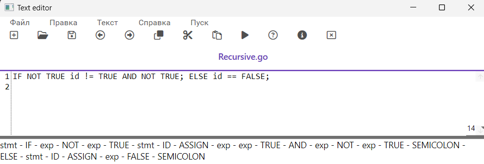

# Реализация метода рекурсивного спуска для синтаксического анализа.
## Цель

Разработать для грамматики алгоритм синтаксического анализа на основе метода рекурсивного спуска.

## Грамматика

Вариант 19
Для грамматики G[stmt] разработать и реализовать алгоритм анализа на основе метода рекурсивного спуска.
G[stmt]:
1. stmt -> IF exp stmt | IF exp stmt ELSE stmt | ID ASSIGN exp SEMICOLON
2. exp -> TRUE | FALSE | exp OR exp | exp AND exp | NOT exp | exp
ID – переменная Б{Б|Ц}, Б – {a, b, c, ...z, A, B, …, Z}, Ц – {0, 1, …, 9}, 
ASSIGN – ”==” | ”<” | ”<=” | ”>” | ”>=” | ”!=”

## Язык

L(G[stmt]) = { (IF epx)<sup>n</sup> ID ASSIGN exp (ELSE (IF epx | ELSE)<sup>k</sup> ID ASSIGN exp)<sup>m</sup>, n >= 0, k >= 0, m >= 0 }

## Классификация грамматики 

Согласно классификации Хомского, грамматика G[stmt] является контексто-свободной.

## Пример допустимых строк:

```
IF FALSE der34 < TRUE;
```

```
IF FALSE der34 <= FALSE OR TRUE AND NOT FALSE ELSE der34 == TRUE;
```

```
IF NOT TRUE id != TRUE AND NOT TRUE ELSE id == FALSE;
```

## Тестовые примеры

1. <p align="center"></p>
1. <p align="center"></p>
1. <p align="center"></p>
